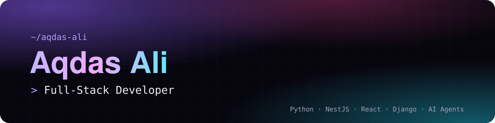

  
  
  

## Hi, I'm Aqdas 👋

I'm a full-stack developer at **Ezauq**, building multi-tenant SaaS products end to end: REST APIs, database design, third-party integrations and the Docker-based deployments that keep them running.

### 🔭 What I'm building

- **Agentawk**: a multi-channel customer messaging platform that brings WhatsApp Business Cloud API, WhatsApp QR, Instagram, Facebook Messenger, Telegram and web chat into one inbox. I designed and shipped its subscription billing, built the *Smart Flows* no-code automation engine and a CSAT analytics system.
- **Feelix AI**: a multi-tenant SaaS where businesses deploy WhatsApp AI agents that answer from their own documents (RAG with Qdrant + GPT-4o) and manage real appointments through a live booking calendar.

Previously, at **Cyberbeak**, I helped convert a live logistics system for a UAE client into **IntelliShip**, a multi-tenant SaaS platform with row-level tenant isolation and multi-currency support.

> Most of my production work lives in private company repositories. The public repos below are personal and academic projects.

### 🛠️ Tech stack

**Backend**

      

**Frontend**

   

**Data & Infrastructure**

         

**AI & Integrations**

     

### 📌 Featured public projects

| Project | What it is |
| --- | --- |
| [AI MediCare System](https://github.com/aqdas-balti/AI-MediCare-System) | Final year project: a Django disease-prediction assistant; the best Scikit-learn model (SVC) reached 98% accuracy |
| [Portfolio](https://github.com/aqdas-balti/Portfolio) | My animated portfolio site built with Next.js, TypeScript and Tailwind CSS, auto-deployed on Vercel |
| [LeetCode Solutions](https://github.com/aqdas-balti/LeedCode-Solutions) | My solutions to LeetCode problems in Python |
| [Data Analytics Coursework](https://github.com/aqdas-balti/Data-Analytics-Course-Work) | Data cleaning, visualization and analysis with Python and SQL |

### 📫 Get in touch

I'm open to full-time and remote roles in full-stack or backend development. The quickest way to reach me is **[aqdasali584@gmail.com](mailto:aqdasali584@gmail.com)**, or visit **[aqdas-ali.vercel.app](https://aqdas-ali.vercel.app)**.
